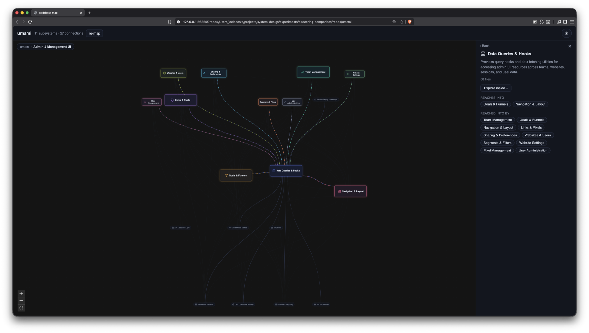
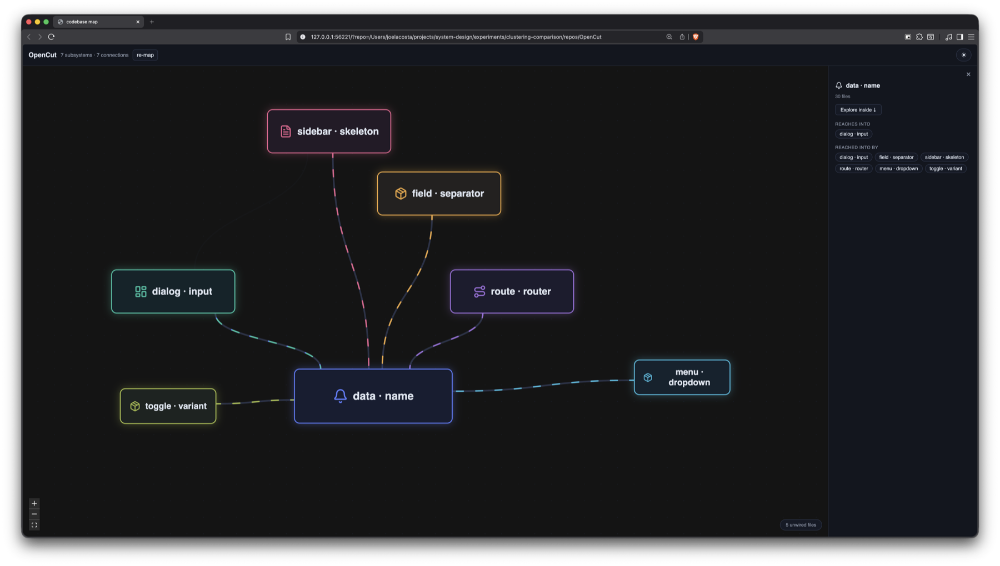

# 🗺️ sysmap

**A map of your codebase you can walk around in — what its parts are, and how they actually
connect.**

Point sysmap at a repository and it draws one box per part of your system, with arrows for what
depends on what. Click a box to see what it touches. Open an arrow to see the exact lines of code
that justify it. Go inside a box to see what it is made of.

## Prerequisites

| | |
|---|---|
| [uv](https://docs.astral.sh/uv/) | runs sysmap. Installs Python for you if you don't have it. |
| [Node](https://nodejs.org) | builds the page during install. Not needed to run it. |
| A git repository | the map is built from what git tracks. |
| An API key | optional. Names the boxes. Without one, they name themselves. |

## Instructions

```bash
cd any-git-repo
uvx --from git+https://github.com/joel1031/sysmap sysmap
```

There is no path to pass and nothing to configure. sysmap finds the repository by walking up to
the nearest `.git`, starts a local server, and opens a browser.

The first run reads every tracked file: seconds on a small repository, minutes on a large one.
Results are held per commit, so every run after that is instant until you commit something.

For model-written names, pass a key:

```bash
uvx --from git+https://github.com/joel1031/sysmap sysmap --api-key sk-...
```

Or export it once and leave the command alone, which is easier on a key you use every day:

```bash
export ANTHROPIC_API_KEY=...
```

The flag wins where both are set.

One request per map, plus one for each arrow you open. Both are kept.

## Examples

### The map

[umami](https://github.com/umami-software/umami) — 924 files, about twenty seconds.


- **Each box is a part of the system sysmap found**, not a folder. "Analytics & Reporting" and
  "Data Collection & Storage" were worked out from how the files use each other, then named.
- **Each line is a dependency**, drawn only where it carries real weight. The panel on the right
  lists what the selected box reaches into and what reaches into it.

### Inside a box

The same map after opening umami's admin area.



- **The map redraws** at the new depth: the admin area's own parts — Team Management, Websites &
  Users, Goals & Funnels — grouped by the same method, over only those files.
- **The faded boxes at the edge are exits**: parts outside this box that its insides still reach.
  Hiding them would make the inside a lie by omission.

### Without a key

[OpenCut](https://github.com/OpenCut-app/OpenCut), mapped with no key at all.



- **The boxes and arrows are identical either way.** They are settled before a model is involved,
  so a key changes the labels and nothing else.
- **Each box is named after its own vocabulary** — words common in its files and rare across the
  repository. The result is uneven: `route · router` is informative, `data · name` is not.

## Methodology

### 1. Reading the code — graphify

[graphify](https://pypi.org/project/graphifyy/) drives [tree-sitter](https://tree-sitter.github.io)
over every file `git ls-files` returns, filtered to the supported extensions. Using git's own file
list means `.gitignore` is obeyed for free: build output and dependencies never enter the map.

graphify returns a symbol-level graph — a node per function, class or value, and an edge per
reference between them. sysmap collapses it to one node per file, with the weight of a file-to-file
edge being the number of symbol references behind it. Direction is kept: A depends on B is not B
depends on A.

Three of graphify's relations name a concrete thing in the target file and are kept: `calls`,
`imports`, and `references`. Where one name is used more than one way, the most telling wins — a
call beats a bare use beats an import.

**Working out which file a name refers to is the hard part.** graphify builds each symbol's
identifier from the path of the file that defines it, so sysmap recovers the file by matching
against that identifier — the pipeline never parses import statements to do it. This is also where
it can be wrong: graphify matches names without regard to case, so `JSON.stringify` attaches itself
to a type of yours called `Json` and invents a dependency between two files that have never met.
Every reference is therefore checked against the source, and thrown out if the name is not really
within a line or two of where it is claimed to be. That removes 9 invented references in a 56-file
repository and 122 in umami.

### 2. Weighing the links — three signals

A signal is evidence that two files belong together. Each is scored 0 to 1 and the three are
averaged in equal thirds.

| Signal | What it measures | Why it earns its place |
|---|---|---|
| **Structural** | one file imports or calls the other, and how often | What the code says. Precise, and blind to anything that isn't a direct reference. |
| **Vocabulary** | shared identifiers and comment words, weighed by how rare each word is across the repository | What the code is about. Catches files that clearly serve one purpose without referring to each other. |
| **History** | how often two files are changed in the same commit | What actually moves together. Independent of both the code and its wording — a fact about the humans. |

Identifiers are split on case and underscores (`processViolation` → `process`, `violation`) so
naming style doesn't hide agreement. Language keywords and boilerplate are dropped, or every file
would look alike. History ignores commits touching more than 12 files: a sweeping rename couples
everything to everything and says nothing.

The three signals are computed **only for pairs of files that already have a structural link** —
the only pairs the grouping ever asks about. Scoring every possible pair instead means scoring the
whole grid of every file against every other: ten thousand files is a hundred million pairs and
roughly 3.2GB of arithmetic, and all but a sliver of it is thrown away unread.

### 3. Finding the parts — Leiden

The grouping runs on the structural graph, with each real link's weight replaced by the combined
signal. [Leiden](https://github.com/vtraag/leidenalg) then pulls out knots of files that link to
each other far more than to anything else. That is the whole idea: a part of your system is a set
of files that mostly talk among themselves.

Leiden searches for the split where each group links to itself as far as possible beyond what the
same number of links would do if they were scattered at random. It runs from a fixed starting
point, so the same commit gives the same map twice.

Every link gets a small constant added to its weight, so a pair that two signals dislike is still
a link and not a severed one. sysmap chose Leiden by measuring it against folders, hierarchical
clustering and a dependency-structure matrix across a 47× range of repository sizes; it kept the
most dependencies inside boxes, which is what makes a map readable. Those baselines still live in
`experiments/`.

The result holds up: **60–79% of all dependencies land inside a box** rather than crossing between
boxes. Repository size barely moves the box count — 757 files and 2,046 files both come out around
18–20 boxes.

### 4. Naming — the last mile

A model receives the file paths in each group and returns a name, a sentence, and an icon from a
fixed list. It never decides membership, so it cannot invent structure — it labels what step 3
already found. One request names every group at once, so it sees the whole system and picks
contrasting names.

With no key, each group is named after its own strongest words, test scaffolding excluded — `mock`
scores well and describes nothing. There is no invented sentence: nothing on that path understood
the code well enough to write one.

### 5. Drawing the arrows — connections

Two parts can be joined by dozens of file-to-file links. Each individual link that crosses a
boundary is a **crossing**; a **dependency** is all the crossings pointing the same way between the
same two parts.

Drawing every dependency gives a hairball, so each is graded. A dependency is **major** if it
carries at least 15% of the crossings leaving its source, and each part's heaviest arrow is always
major. No part draws more than three. The majors are the backbone — the arrows on the map. The rest
are counted and listed, not drawn.

A part with no crossings at all is set aside: an **island** if its files use each other, **noise**
if they don't. Noise goes to a tray rather than the map, so a hundred unrelated single files can't
bury the structure.

Every arrow opens: a sentence on how the two parts work together, then the crossings behind it,
then each reference, down to the line that uses a thing and the line that defines it.

## Supported languages

**C, Go, Java, Python, TypeScript/JavaScript.** Each was checked by hand against a real
repository — see [docs/language-support.md](docs/language-support.md) for what, and how many links
survived inspection.

graphify ships grammars for 25 languages. sysmap claims five, because volume is not correctness.
Ruby produced plenty of links and roughly none of a sample survived inspection: a bare word parses
as a method call, so parameters became calls and every standard-library method matched a same-named
method in the repository. Swift produced 4.21 links per file — the second-densest language
measured — because `import Foundation` resolved to an arbitrary file in the repository, pointing
every importer at the same innocent bystander.

The pattern in every case is the same: **a name belonging to something outside the repository,
matched to a file inside it.** Density measures how eagerly that happens, not how often it is
right.

## Limitations

- **Nothing crosses a language boundary.** A Python backend and a TypeScript frontend in one
  repository draw as two islands with no arrows between them. In a 1,252-file repository, all
  twelve links drawn between the two languages were false, and removing them was a bug fix.
- **A shallow clone quietly weakens it.** The history signal reads your commits, so `--depth 1`
  leaves it nothing to read, and nothing says so.
- **Tests group with the code they test.** Correct, and rarely what you wanted to look at.
- **Vue and Svelte are not read**, so Nuxt and SvelteKit apps map only their plain TypeScript.
- **Names need a key.** Without one the structure is real and the labels are vague.
- **Path aliases and monorepo layouts** are unproven. What resolves cleanly in a flat repository may
  thin out where paths are rewritten.

## Follow-up

| | |
|---|---|
| [CONTEXT.md](CONTEXT.md) | The vocabulary. *Subsystem*, *dependency*, *crossing* and *reference* are used precisely throughout the code and docs, and defined here. |
| [docs/language-support.md](docs/language-support.md) | Every language measured, the repository it was measured on, and how many of its links survived inspection. |
| [docs/](docs/) | How each piece was built, what was measured, and what was rejected on the way. |
| [experiments/](experiments/) | The harness the grouping method was chosen with, including the baselines it beat. |

## License

MIT.
