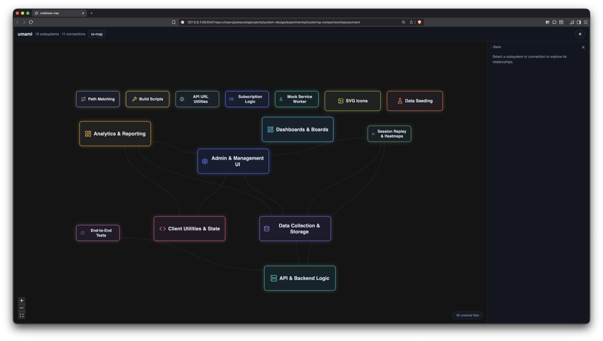

# sysmap

**A traversable map of your codebase — what its subsystems are, and how they actually connect.**

Built from what your code imports and calls, not from your folder tree.



That's [umami](https://github.com/umami-software/umami), 924 files, mapped in about twenty
seconds. Nobody told it what "Analytics & Reporting" or "Data Collection & Storage" were.

## Run it

You need [uv](https://docs.astral.sh/uv/), and [Node](https://nodejs.org) to build the page.

```bash
cd any-git-repo
uvx --from git+https://github.com/joel1031/sysmap sysmap
```

That's the whole thing. No path to pass and nothing to configure — the repo is wherever you're
standing, found by walking up to the nearest `.git`. It opens a browser.

The first run parses the whole repo: seconds for a small one, minutes for a big one. After that
it's instant until you commit something.

## Better names, optionally

Without a key, subsystems are named after their own vocabulary — the words common in those files
and rare everywhere else. It's honest, and it's not prose:

> `stripe · violation` &nbsp;·&nbsp; `plaid · webhook` &nbsp;·&nbsp; `dialog · input`

With a key, a model reads the file paths and names them properly — the map above is what that
looks like. It never decides what groups with what; it only labels what the grouping already found.

```bash
export ANTHROPIC_API_KEY=...
```

One call per map, plus one per connection you actually open. Both are cached.

## What you can do with it

**Click a subsystem** to see what it reaches into and what reaches into it.

**Open a connection** to see why two subsystems are joined: a sentence, then the individual
file-to-file crossings, then the exact references — down to the line that imports it and the line
that defines it.

**Go inside a subsystem** and the map redraws: its own sub-subsystems, with anything it touches
beyond itself drawn at the edge. Keep going and you reach the files, then the code.

## How it works

1. **Parse** — tree-sitter, via [graphify](https://pypi.org/project/graphifyy/), turns every
   tracked file into symbols and the references between them, collapsed to one node per file.
2. **Weigh** — three signals say how strongly two files belong together: one imports or calls the
   other, they share vocabulary, and they change in the same commits.
3. **Group** — [Leiden](https://github.com/vtraag/leidenalg) community detection finds the
   subsystems. Across the repos we measured it keeps 60–79% of dependencies *inside* subsystems,
   which is why the map has few enough arrows to read.
4. **Name** — a model labels the groups, or the groups name themselves.

The grouping cuts across your directory tree on purpose. That a subsystem doesn't match your
folders is usually the most interesting thing the map has to say.

## What it reads

**C, Go, Java, Python, TypeScript/JavaScript.** Those are measured, by hand, on real repos — see
[docs/language-support.md](docs/language-support.md) for what each was checked against.

graphify parses many more languages, and we don't claim them. Density is not correctness: Ruby
looked dense and was almost entirely wrong (a bare identifier parses as a method call), and Swift
looked dense because `import Foundation` resolved to an arbitrary file in the repo. Both are in
the doc, with the numbers.

## What it won't do yet

- **Nothing crosses a language boundary.** A Python backend and a TypeScript frontend in one repo
  draw as two islands with no arrows between them, because a reference from one to the other isn't
  something this resolves. It is not pretending otherwise.
- **A shallow clone quietly weakens it.** The co-change signal reads git history; `--depth 1`
  leaves it with nothing to read and nothing says so.
- **Tests group with the code they test.** Correct, and usually not what you wanted to look at.
- **Vue and Svelte are not read**, so Nuxt and SvelteKit apps map only their plain TS.

## Why

LLM-assisted coding makes it easy to become a passive passenger in your own codebase. The model
has knowledge but no taste, no judgment, and no understanding of your particular system. That gap
is yours, and it's hard to fill what you can't see.

This is the part that lets you see it. See [CONTEXT.md](CONTEXT.md) for the vocabulary, and
[docs/](docs/) for how each layer was built and what was rejected on the way.

## License

MIT.
